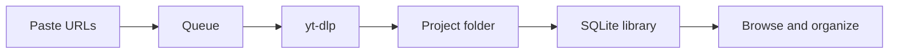

<div align="center">

# METO Bulk Video Downloader

**Local web UI for queuing and downloading videos with [yt-dlp](https://github.com/yt-dlp/yt-dlp).**  
Organize by project, browse your library, tag favorites — all on your machine.

[](https://www.python.org/)
[](https://flask.palletsprojects.com/)
[](https://github.com/yt-dlp/yt-dlp)
[](https://www.docker.com/)
[](https://www.sqlite.org/)

[Features](#features) · [Installation](#installation) · [Start](#start) · [Database backup](#database-backup) · [Docker](#docker) · [Configuration](#configuration) · [Türkçe](#türkçe--kurulum-ve-kullanım)

</div>

---

## Features

| | |
| :--- | :--- |
| **Bulk downloads** | Paste video, playlist, or channel links (one per line). Queue runs in the background with live progress. |
| **Projects** | Separate folders and settings per project — great for courses, research, or themed collections. |
| **Library** | Search, filter, sort, tag, and favorite videos. Metadata stored in SQLite. |
| **Flexible output** | Quality caps, MP4/MKV/WebM, audio-only, subtitles, thumbnails, rate limits, custom templates. |
| **Optional auth** | Username/password login when exposing the app beyond localhost. |
| **Docker-ready** | One-command deploy; data persists in `./data`. Works with Dokploy and similar platforms. |

---

## Installation

### Prerequisites (all platforms)

| Requirement | Notes |
| :--- | :--- |
| **Python 3.11+** | [python.org/downloads](https://www.python.org/downloads/) |
| **ffmpeg** | On your PATH — [ffmpeg.org/download.html](https://ffmpeg.org/download.html) |
| **Node.js** (recommended) | Needed by yt-dlp for YouTube — [nodejs.org](https://nodejs.org/) |
| **Git** | To clone the repository |

### Windows

Easiest path — double-click or run from Command Prompt / PowerShell:

```bat
git clone https://github.com/metinuysal/meto-video-downloader.git
cd meto-video-downloader
install.bat
```

`install.bat` will:

1. Find or install Python (via winget if needed)
2. Create `.venv` and install dependencies
3. Check FFmpeg and Node.js
4. Create `dbbackup/` and `.env` if missing
5. Set up the SQLite database (`db_backup.py --install`)

### Linux

```bash
git clone https://github.com/metinuysal/meto-video-downloader.git
cd meto-video-downloader

python3 -m venv .venv
source .venv/bin/activate
pip install -r requirements.txt

test -f .env || cp .env.example .env
python db_backup.py --install
```

Install system packages if needed (examples):

```bash
# Debian / Ubuntu
sudo apt update && sudo apt install -y python3-venv ffmpeg nodejs git

# Fedora
sudo dnf install -y python3 ffmpeg nodejs git
```

### macOS

```bash
git clone https://github.com/metinuysal/meto-video-downloader.git
cd meto-video-downloader

python3 -m venv .venv
source .venv/bin/activate
pip install -r requirements.txt

test -f .env || cp .env.example .env
python db_backup.py --install
```

Install prerequisites with [Homebrew](https://brew.sh/) if needed:

```bash
brew install python ffmpeg node
```

---

## Start

After installation, open **http://localhost:5000** in your browser.

### Windows

Double-click **`start.bat`**, or:

```bat
start.bat
```

### Linux / macOS

Activate the virtual environment, then run the app:

```bash
source .venv/bin/activate
python app.py
```

Or in one line from the project folder:

```bash
.venv/bin/python app.py
```

Stop the server with **Ctrl+C** in the terminal.

### Docker

See the [Docker](#docker) section below — no local Python install required.

---

## Database backup

For local (non-Docker) SQLite installs, the repo includes a ready-to-use empty database at [`dbbackup/bulk_video.db`](dbbackup/bulk_video.db) (schema applied, no videos).

| Action | How |
| :--- | :--- |
| **First install** | `install.bat` or `python db_backup.py --install` copies/seeds `bulk_video.db` automatically |
| **Download backup** | Settings → Database Backup → Download ZIP |
| **Restore** | Put `restore.zip` in `dbbackup/` and rerun `install.bat`, or copy `bulk_video.db` to the project root |

MySQL / PostgreSQL users: configure `BULK_VIDEO_DB_URL` in `.env` — see [Configuration](#configuration).

More details: [`dbbackup/README.txt`](dbbackup/README.txt)

---

## How it works



1. Add links on the **Download** page — videos, playlists, and channels mixed together.
2. The queue downloads in the background; duplicates are skipped automatically.
3. Finished files land in the active **project folder** and appear in **Library**.
4. Filter, tag, favorite, or bulk-move items from the library UI.

---

## Docker — Tak-Çalıştır (MySQL Dahil)

**Sıfır ayar, tek komut (önerilen):**

```bash
git clone https://github.com/metinuysal/meto-video-downloader.git
cd meto-video-downloader
chmod +x deploy.sh
./deploy.sh
# -> http://localhost:5000 (veya http://SUNUCU_IP:5000)
```

`deploy.sh` ne yapar?
1. `.env` yoksa otomatik oluşturur (`SECRET_KEY`, `MYSQL_ROOT_PASSWORD`, `MYSQL_PASSWORD` rastgele)
2. `./data` klasörünü hazırlar
3. `docker compose up --build -d` ile **app + MySQL 8.0**'ı ayağa kaldırır
4. Healthcheck'leri bekler ve URL'yi yazdırır

Diğer komutlar:
```bash
./deploy.sh logs     # canlı log
./deploy.sh ps       # durum
./deploy.sh down     # durdur (veriler kalır)
./deploy.sh update   # git pull + rebuild
./deploy.sh clean    # DİKKAT: tüm verileri siler
```

**Manuel (deploy.sh olmadan):**
```bash
# .env olmadan da çalışır — varsayılan şifreler (rootsecret/bulkpass) kullanılır
docker compose up --build -d
docker compose ps
docker compose logs -f

# .env ile özelleştir:
cp .env.example .env
# .env içini düzenle, sonra tekrar:
docker compose up --build -d
```

**Tek imaj (MySQL'siz, SQLite):**
```bash
docker build -t meto-video .
docker run --rm -p 5000:5000 -v "$(pwd)/data:/data" meto-video
```

- Videolar `./data` içinde, MySQL verileri `mysql_data` volume'de saklanır (Dokploy'da otomatik prefixlenir)
- Container `0.0.0.0` dinler, `PORT`/`BULK_VIDEO_PORT` değişkenini okur (`deploy.sh` ve `docker-compose.yml` üzerinden)
- MySQL host: `db` (compose iç network), dışarı kapalı — açmak için `docker-compose.yml:14` `ports` satırını aç
- `expose: ${PORT:-5000}` + `ports: ${PORT:-5000}:${PORT:-5000}` → Dokploy Traefik ve local `docker compose up` ile uyumlu
- `container_name` yok → Dokploy multi-deploy çakışmaz, `healthcheck` Traefik için zorunlu

### Dokploy ile Deploy (Önerilen PaaS)

Dokploy `docker-compose.yml`'i doğrudan destekler — ek ayar gerekmez:

1. Dokploy → **Projects** → **Create Service** → **Compose** → isim ver (örn. `meto`)
2. **Source**: **GitHub** (repo URL) veya **Raw** (bu `docker-compose.yml`'i yapıştır)
3. **Environment** sekmesinde değşikenleri ekle (Dokploy otomatik `SECRET_KEY` üretir, istersen elle):
   ```
   PORT=5000
   SECRET_KEY=<openssl rand -hex 32>
   MYSQL_ROOT_PASSWORD=<güçlü şifre>
   MYSQL_PASSWORD=<güçlü şifre>
   BULK_VIDEO_USERNAME=admin  # opsiyonel login
   BULK_VIDEO_PASSWORD=...
   ```
4. **Domains** → **Add Domain** → Service: `bulk-video`, Internal Port: `5000`, Let's Encrypt seç
5. **Deploy** → **Preview Compose** ile Traefik label'larını kontrol et → Deploy

Not: `expose` ve `healthcheck` zaten var, Dokploy `dokploy-network`'ü otomatik enjekte eder. MySQL'e domain verme, iç network `db:3306` ile erişilir.

---

## Configuration

Copy [`.env.example`](.env.example) to `.env` and adjust as needed.

| Variable | Default | Description |
| :--- | :--- | :--- |
| `SECRET_KEY` | — | Session secret. **Required** when `BULK_VIDEO_DEBUG=false` |
| `BULK_VIDEO_HOST` | `127.0.0.1` | Bind address |
| `BULK_VIDEO_PORT` / `PORT` | `5000` | HTTP port |
| `BULK_VIDEO_DEBUG` | `0` | Enable Flask debug mode |
| `BULK_VIDEO_DB_PATH` | `./bulk_video.db` | SQLite database path |
| `BULK_VIDEO_VIDEO_DIR` | `./videos` | Download output directory |
| `BULK_VIDEO_USERNAME` | — | Optional login username |
| `BULK_VIDEO_PASSWORD` | — | Optional login password |
| `BULK_VIDEO_STORAGE_MAX_MB` | — | Pause downloads when storage exceeds this limit (MB) |

MySQL and PostgreSQL are supported via `BULK_VIDEO_DB_URL` — see `.env.example` for examples.

---

## Built with

- [**yt-dlp**](https://github.com/yt-dlp/yt-dlp) — media extraction and downloads
- [**Flask**](https://flask.palletsprojects.com/) — web UI and API
- [**SQLite**](https://www.sqlite.org/) — local metadata storage

---

## Notes

> **Local-first:** This app is meant to run on your own machine. If you expose it on a network, enable authentication first.

Use responsibly and only download content you have the right to access.

---

## About

Built by **[Metin Uysal](https://metinuysal.net)** · [GitHub](https://github.com/metinuysal)

---

## Türkçe — Kurulum ve kullanım

METO Bulk Video Downloader, bilgisayarında çalışan yerel bir web arayüzüdür. Video linklerini sıraya alır, `yt-dlp` ile indirir; projelere ayırır, kütüphanede etiketler ve favorilerle düzenlersin.

### Gereksinimler

- **Python 3.11+**
- **ffmpeg** (PATH’te olmalı)
- **Node.js** (YouTube için önerilir)
- **Git** (repoyu klonlamak için)

### Kurulum

**Windows** — en kolay yol:

```bat
git clone https://github.com/metinuysal/meto-video-downloader.git
cd meto-video-downloader
install.bat
```

`install.bat` Python’u bulur/kurar, sanal ortam oluşturur, bağımlılıkları yükler, `.env` ve veritabanını hazırlar.

**Linux / macOS:**

```bash
git clone https://github.com/metinuysal/meto-video-downloader.git
cd meto-video-downloader

python3 -m venv .venv
source .venv/bin/activate
pip install -r requirements.txt

test -f .env || cp .env.example .env
python db_backup.py --install
```

### Başlatma

Kurulumdan sonra tarayıcıda **http://localhost:5000** adresini aç.

| İşletim sistemi | Komut |
| :--- | :--- |
| **Windows** | `start.bat` (çift tıklama veya terminalden) |
| **Linux / macOS** | `source .venv/bin/activate` → `python app.py` |
| **Docker** | `docker compose up --build` |

Durdurmak için terminalde **Ctrl+C**.

### Veritabanı yedeği

Varsayılan olarak **SQLite** kullanılır. Repoda hazır boş veritabanı vardır: `dbbackup/bulk_video.db` (tablolar oluşturulmuş, video yok).

- **İlk kurulum:** `install.bat` veya `python db_backup.py --install` otomatik kurar
- **Yedek indir:** Ayarlar → Database Backup → Download ZIP
- **Geri yükle:** `dbbackup/restore.zip` koy → `install.bat` tekrar çalıştır  
  veya zip’ten `bulk_video.db` dosyasını proje köküne ( `app.py` yanına ) kopyala

MySQL / PostgreSQL kullanıyorsan `.env` içinde `BULK_VIDEO_DB_URL` ayarla — ayrıntılar [`.env.example`](.env.example) dosyasında.

### Docker — Tak-Çalıştır (Önerilen)

Sıfır kurulum, MySQL dahil:

```bash
git clone https://github.com/metinuysal/meto-video-downloader.git
cd meto-video-downloader
chmod +x deploy.sh
./deploy.sh
# Tarayıcı: http://localhost:5000  (sunucuda: http://SUNUCU_IP:5000)
```

Alternatifler:
```bash
./deploy.sh logs     # log izle
./deploy.sh ps       # durum
./deploy.sh down     # durdur
docker compose up --build -d   # .env olmadan manuel (varsayılan şifrelerle çalışır)
```

**Sunucuya teslim (tak-çalıştır paket):**
1. Bu klasörü zip'le veya `git clone` ver
2. Sunucuda tek komut: `./deploy.sh`
3. `PORT=5000` çakışırsa `.env` içinde değiştir, tekrar `./deploy.sh`
4. Tersine proxy (Nginx) gerekiyorsa `http://127.0.0.1:5000`'a yönlendir
5. Yedek: `docker compose exec db mysqldump -u root -p bulk_video > backup.sql` ve `./data` klasörü

Veriler `./data` (videolar) ve `mysql_data` volume (MySQL, Dokploy'da prefixlenir) içinde kalıcıdır.

**Dokploy ile tek tık:**
Dokploy → Compose Service → Git/Raw olarak `docker-compose.yml` → Environment doldur → Domains → `bulk-video:5000` seç → Deploy. `expose`/`healthcheck` hazır, Traefik otomatik.

### Not

Uygulama **yerelde** çalışmak içindir. Ağa açacaksan önce kullanıcı adı/şifre (`BULK_VIDEO_USERNAME`, `BULK_VIDEO_PASSWORD`) ekle. İndirdiğin içerikler için platform kurallarına ve telif haklarına dikkat et.

<div align="center">

<sub>Made with ☕ and yt-dlp</sub>

</div>
